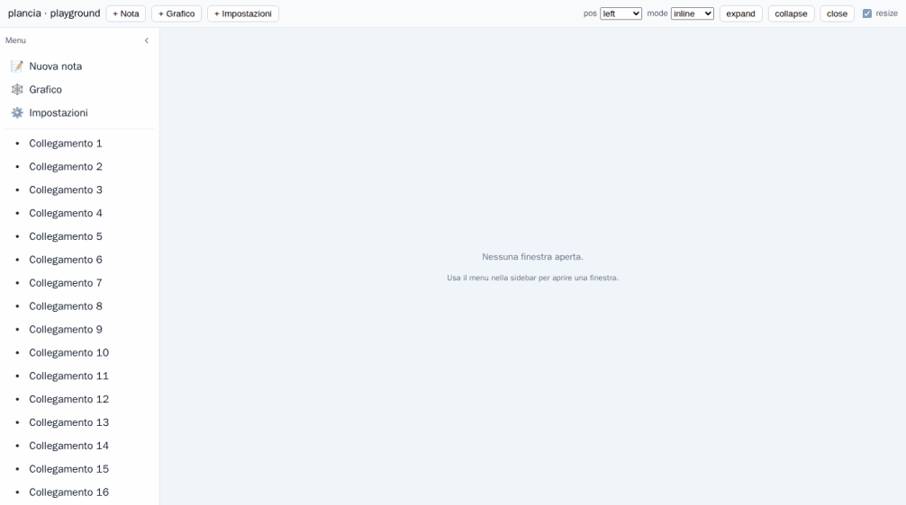

# Sidebar

`<PlanciaSidebar>` is a content-agnostic, themeable panel for any of the four
edges, with `closed` / `collapsed` / `expanded` states and a body that scrolls
independently of your content. Same philosophy as the window manager: CSS
variables (no Tailwind), inline SVG (no icon dependency), injectable strings (no
i18n lock-in), a11y-aware.

It is **standalone** — usable anywhere, with or without `<Plancia>`.

```ts
import { PlanciaSidebar } from 'plancia'
import 'plancia/style.css'
```

```vue
<PlanciaSidebar position="left">
  <nav><!-- your menu / list / anything --></nav>
</PlanciaSidebar>
```



## Position & orientation

`position` picks the edge; the **orientation** is derived:

| `position` | orientation | "size" is | body scrolls |
|---|---|---|---|
| `left` / `right` | vertical | width | vertically |
| `top` / `bottom` | horizontal | height | horizontally |

## Modes

| `mode` | Behaviour |
|---|---|
| `inline` *(default)* | Takes layout space; your content reflows into the remainder — no JS needed (it's just a flex item). |
| `overlay` | Sits **over** the content, which keeps its full size underneath. |
| `floating` | Like `overlay`, but a detached card (gap on all sides, elevation, rounded corners). |

> **`overlay` / `floating` need a positioned ancestor.** They are
> `position: absolute`, so wrap the sidebar + content in a container with
> `position: relative` (see [Layout recipe](#layout-recipe)).

## States

| State | Vertical (left/right) | Horizontal (top/bottom) |
|---|---|---|
| `expanded` | full width | full height |
| `collapsed` | icon **rail** (`--plancia-sidebar-rail`) | compact bar (header only) |
| `closed` | off-canvas; a small **reveal** tab remains | off-canvas; reveal tab |

The toggle button cycles `expanded ⇄ collapsed`; the reveal tab re-opens to the
last non-closed state.

## Props

| Prop | Type | Default | Notes |
|---|---|---|---|
| `position` | `'left' \| 'right' \| 'top' \| 'bottom'` | `'left'` | Anchored edge. |
| `mode` | `'inline' \| 'overlay' \| 'floating'` | `'inline'` | Relation to content. |
| `state` | `'closed' \| 'collapsed' \| 'expanded'` | — | `v-model:state` (controlled). |
| `defaultState` | same | `'expanded'` | Initial state when uncontrolled. |
| `size` | `number` (px) | — | `v-model:size` — expanded cross-axis size. |
| `defaultSize` | `number` (px) | — | Initial size when uncontrolled. |
| `railSize` | `number \| string` | — | Collapsed size override (number → px). |
| `minSize` / `maxSize` | `number` | `120` / `640` | Resize bounds (px). |
| `resizable` | `boolean` | `false` | Show a drag handle on the inner edge. |
| `peek` | `boolean` | `true` for overlay/floating | Hover-peek when collapsed. |
| `peekDelay` | `{ open: number; close: number }` | `{ 120, 240 }` | Hover-intent delays (ms). |
| `draggable` | `boolean` | `false` | In `floating` mode, drag the panel by its header. |
| `responsive` | `number \| false` | `false` | Below this viewport width (px), become an overlay drawer. |
| `backdrop` | `boolean` | only while a responsive drawer is open | Scrim behind the panel. |
| `labels` | `Partial<SidebarLabels>` | English defaults | UI strings, merged over defaults. |
| `landmark` | `'navigation' \| 'complementary' \| 'region' \| 'none'` | `'complementary'` | ARIA landmark role. |
| `ariaLabel` | `string` | `labels.sidebar` | Accessible name. |

### `v-model`

Both `state` and `size` are two-way. Omit them for uncontrolled use (the
component keeps its own state, seeded by `defaultState` / `defaultSize`).

```vue
<PlanciaSidebar v-model:state="state" v-model:size="size" resizable />
```

When **no** size is given explicitly (no `size`/`defaultSize` and no drag), the
panel uses the themeable `--plancia-sidebar-expanded-size`, so your theme stays
in control.

## Events

| Event | Payload | When |
|---|---|---|
| `update:state` | `SidebarState` | State changed (drives `v-model:state`). |
| `update:size` | `number` | Size changed (drives `v-model:size`). |
| `expand` / `collapse` / `close` / `open` | — | The matching transition fired. |
| `peek-start` / `peek-end` | — | A hover preview began / ended. |
| `resize` | `number` | New size (px) during/after a drag. |
| `move` | `{ x: number; y: number }` | The floating panel was dragged (px in the offset parent). |

## Slots

Every slot is **scoped** with `SidebarSlotProps`, so content can adapt to the
current signal and drive the sidebar:

```ts
interface SidebarSlotProps {
  state: SidebarState
  position: SidebarPosition
  orientation: SidebarOrientation
  mode: SidebarMode
  size: number
  peeking: boolean
  contentVisible: boolean        // expanded OR peeking
  expand(): void; collapse(): void; close(): void; open(): void; toggle(): void
}
```

| Slot | Purpose |
|---|---|
| default | The body (the scrolling region). |
| `header` | Pinned header (does not scroll); the default toggle button sits here. |
| `footer` | Pinned footer (does not scroll). |
| `collapsed` *(alias of the rail content)* | Shown instead of the body while `collapsed` (and not peeking). Omit it and the default slot renders — branch on `contentVisible` yourself. |
| `toggle` | Replace the built-in collapse/expand button. |
| `reveal` | Replace the built-in reveal tab shown when `closed`. |

```vue
<PlanciaSidebar position="left" :default-size="240">
  <template #header="{ contentVisible }">
    <strong v-if="contentVisible">Menu</strong>
  </template>
  <template #default="{ contentVisible }">
    <button v-for="i in items" :key="i.id" @click="i.run">
      <span>{{ i.icon }}</span>
      <span v-if="contentVisible">{{ i.label }}</span>
    </button>
  </template>
</PlanciaSidebar>
```

## Drag-resize

Set `resizable` to add a drag handle on the inner edge (resizes the expanded
size, clamped to `min`/`max`). It is keyboard-operable (`role="separator"`,
arrow keys; `Shift` for a larger step). Resizing pins `--plancia-sidebar-size`
and emits `update:size` + `resize`.

## Hover-peek

In `collapsed` + `overlay`/`floating`, hovering shows a **transient** expanded
preview without committing the state (leave → back to `collapsed`), with
hover-intent delays (`peekDelay`). `Esc` steps the sidebar down
(peek → collapsed → closed). Disabled in `inline` (where it would shove your
content); override with the `peek` prop.

## Responsive drawer

`:responsive="768"` makes the sidebar an overlay **drawer** below that viewport
width: it switches to `overlay`, pins to the viewport, and (by default) shows a
`backdrop` that closes it on click. Above the breakpoint it returns to its
declared `mode`.

## Draggable floating

In `floating` mode, set `draggable` to let the user reposition the panel by
dragging its **header** — it becomes a compact, scrollable palette. The drag is
clamped to the positioned ancestor, and a `move` event reports the new `{ x, y }`
(px, relative to that ancestor). Drags that start on an interactive control
(`button`/`a`/`input`/`select`/`textarea`) — or any element you mark `data-no-drag`
— are ignored, so the toggle and your menu items keep working.

```vue
<PlanciaSidebar position="left" mode="floating" draggable @move="onMove" />
```

## External control & optional store

A control living **inside** the sidebar's slot content can drive it without
prop-drilling — mirrors the window manager's `useOpenWindow`:

```ts
import { usePlanciaSidebar } from 'plancia'
const sidebar = usePlanciaSidebar()   // null if outside a <PlanciaSidebar>
sidebar?.toggle()
```

For a control **outside** the sidebar, bind `v-model`, or use the opt-in global
store when several parts of the app share one sidebar:

```ts
import { usePlanciaSidebarStore } from 'plancia'
const sb = usePlanciaSidebarStore()
const main = sb.entry('main', { state: 'collapsed' })
// <PlanciaSidebar v-model:state="main.state" v-model:size="main.size" />
// elsewhere: sb.toggle('main')
```

The store is **optional** — the component is fully usable without it.

## Theming

All visual knobs are CSS custom properties (override on `:root` or any ancestor):

| Variable | Default | Purpose |
|---|---|---|
| `--plancia-sidebar-expanded-size` | `16rem` | Expanded cross-axis size (when no explicit `size`). |
| `--plancia-sidebar-rail` | `3rem` | Collapsed rail size. |
| `--plancia-sidebar-size` | *(set by the component)* | Pinned size when a `size`/drag is in effect. |
| `--plancia-sidebar-bg` | `var(--plancia-surface)` | Background. |
| `--plancia-sidebar-border` | `var(--plancia-border)` | Edge / card border. |
| `--plancia-sidebar-shadow` | `0 8px 24px rgba(0,0,0,.12)` | Floating elevation. |
| `--plancia-sidebar-radius` | `var(--plancia-radius)` | Floating corner radius. |
| `--plancia-sidebar-gap` | `0.75rem` | Floating detach margin. |
| `--plancia-sidebar-backdrop` | `rgba(0,0,0,.32)` | Backdrop color. |
| `--plancia-sidebar-z` | `40` | Overlay/floating z-index. |
| `--plancia-sidebar-transition` | `160ms` | Size transition (off under `prefers-reduced-motion`). |

State and orientation are also exposed as `data-*` attributes
(`data-position`, `data-orientation`, `data-mode`, `data-state`, `data-peeking`)
for your own CSS hooks.

### Labels

```ts
interface SidebarLabels {
  expand: string; collapse: string; close: string
  open: string; resize: string; sidebar: string
}
```

Pass `:labels="{ collapse: 'Comprimi', … }"` (merged over the English defaults).

## A11y

- Configurable landmark `role` (`navigation` for menus, `complementary`…).
- The toggle carries `aria-expanded` + `aria-controls`; the reveal tab too.
- `Esc` closes/steps-down an overlay/floating sidebar (non-modal — no focus
  trap; it never blocks the page).
- Size transitions are disabled under `prefers-reduced-motion`.
- The resize handle is a focusable `separator` with arrow-key support.

## Inside `<Plancia>`

`<Plancia>` exposes edge slots — `sidebar-left`, `sidebar-right`, `sidebar-top`,
`sidebar-bottom` — that arrange the sidebar around the window strip for you
(`top`/`bottom` full width, `left`/`right` flanking; the middle band is already
`position: relative`, so `overlay`/`floating` anchor correctly). Because the slot
content lives inside `<Plancia>`, a menu **component** placed there can open
windows via `useOpenWindow()` with no wiring. (Call it from a component rendered
*inside* `<Plancia>` — the menu is its own component, not the parent that renders
`<Plancia>` — since that's where the injection resolves.)

```vue
<!-- SidebarMenu.vue — rendered in the slot, so it's a <Plancia> descendant -->
<script setup lang="ts">
import { useOpenWindow } from 'plancia'
const open = useOpenWindow()
</script>

<template>
  <nav>
    <button @click="open({ type: 'note', key: 'note:new' })">New note</button>
  </nav>
</template>
```

```vue
<!-- App.vue -->
<Plancia :registry="registry">
  <template #sidebar-left>
    <PlanciaSidebar position="left" :responsive="768">
      <SidebarMenu />
    </PlanciaSidebar>
  </template>
</Plancia>
```

To use it standalone (outside `<Plancia>`), arrange it yourself:

## Layout recipe

For a ready-made shell that arranges up to four edges + a centre, use
[`<PlanciaLayout>`](./components.md#plancialayout). To arrange it by hand instead:
`inline` is just flex; `overlay`/`floating` need a `position: relative` wrapper.

```vue
<template>
  <!-- left/right: a row; top/bottom: a column -->
  <div class="layout">
    <PlanciaSidebar position="left" :responsive="768"> … </PlanciaSidebar>
    <main class="layout__content"><!-- your app / <Plancia/> --></main>
  </div>
</template>

<style>
.layout { position: relative; display: flex; height: 100%; }   /* relative ⇒ overlay/floating anchor here */
.layout__content { flex: 1 1 0; min-width: 0; }                /* fills the remainder */
</style>
```

For a `right` sidebar use `flex-direction: row-reverse` (or place it after the
content); for `top`/`bottom` use a `column` / `column-reverse` layout.
